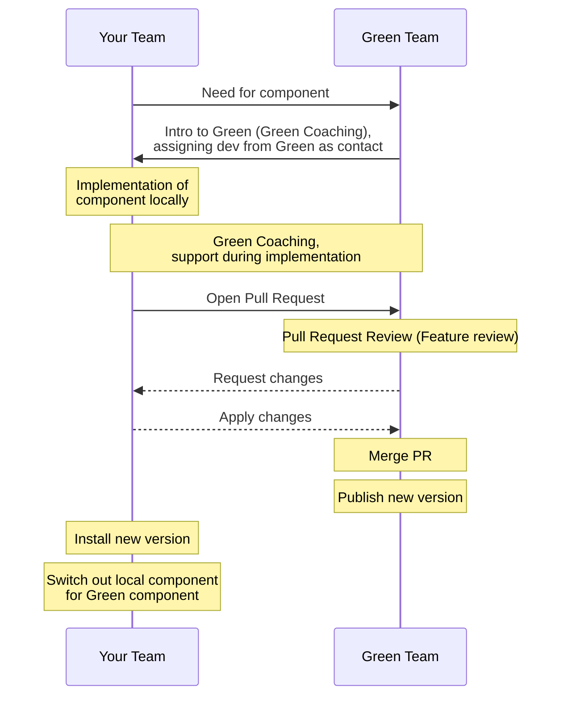

# Contributing

Welcome! How wonderful to see you ❤️

The Green Design System is developed as an Inner Source project, meaning basically Open Source but constrained to one organization. This means we need you and, hopefully, you need us.

## Contribution process

<small>_Diagram over the contribution process for Green Design System_</small>

### Need for component

The first step in the contribution process is a need within a team for a specific component or feature.

### Intro to Green Design System

Second step in the process is for that team to [get in touch with the Green Team](https://teams.microsoft.com/l/team/19%3AR-yrtyItfX3RWEyU8WrCyVy6u-eqWxYPbY1w2O7UVPs1%40thread.tacv2/conversations?groupId=3ad3eb8f-ab23-44e6-9b61-d08fee172513&tenantId=9a8ff9e3-0e35-4620-a724-e9834dc50b51) to check the following things:

- Is this feature currently being worked on by someone?
- How should the team go forward with contributing this feature/component?
- Get assigned a co-pilot (someone from the Green Team) who can answer questions that arise during implementation.

This intro is often held during Green Coaching which can be booked [here](https://teams.microsoft.com/l/entity/0d820ecd-def2-4297-adad-78056cde7c78/_djb2_msteams_prefix_4065088102?context=%7B%22channelId%22%3A%2219%3A33f450cae2764531930c4eca19aa4c26%40thread.tacv2%22%7D&tenantId=9a8ff9e3-0e35-4620-a724-e9834dc50b51).
If the time for this meeting doesn't fit, reach our to the Green Team.

### Implementation

Now the team can start implementing the component or feature locally, focusing on their specific requirements, deliveries and dead-lines. During this process Green Coaching can be used to get hands on support from the Green Team.

When the Team feels that enough work has been done on the feature, a PR is opened in the Green repository.

### Review

The Green Team will do a review of the PR and, if needed, request any additional changes.

When the PR is merged, Greens code packages will be versioned and published. The team can then switch out it's local component or feature with the one that is now in Green.

## Issues and PRs

If you have suggestions for how Green could be improved, or want to report a bug, open an issue! We love all and any contributions. If you have questions, too, we'd love to hear them. Try to have a short but informative title and longer text in the description. Also try to find labels that fits the subject.

Eg: `Button: Font size and spacings too big` could be tagged with the `Comp: Button` label.

**\*Note:** Before you open an issue or PR, consider the classification of information you are about to add in it. Only add information if you are certain that it's classified as open (C1).\*

### PRs

We also love PRs. If you're thinking of a large PR, we advise going through the process outlined above, though!

Have a look at the links below if you're not sure how to open a PR.

## Submitting a pull request (PR)

_If you are an SEB Employee opening a PR it's always good to notify the Green team through an SEB communication channel so we know who to turn to if we have questions regarding the PR._

1. [Fork](https://github.com/seb-oss/green/fork) and clone the repository.
1. Make sure you fulfill the technical pre-requisites

- Node LTS version. Check here for supported versions: https://nodejs.org/en/about/previous-releases
- Yarn (`npm install -g yarn`)

1. Install the dependencies: `yarn`.
1. Make sure the tests pass on your machine: `yarn test`, note: these tests also apply the linter, so there's no need to lint separately.
1. Create a new branch: `git checkout -b feat/my-new-cool-component`.
1. Write the tests, write the code, and make sure the tests pass.
1. Commit your changes
1. Add a changeset by running `npx changeset`
1. Push to your fork and [submit a pull request](https://github.com/seb-oss/green/pulls).
1. Pat your self on the back and wait for your pull request to be reviewed and merged.

Here are a few things you can do that will increase the likelihood of your pull request being accepted:

- Write and update tests.
- Keep your changes as focused as possible. If there are multiple changes you would like to make that are not dependent upon each other, it is better to submit them as separate pull requests.
- Run `yarn smoketest`. This will lint, compile and test all the code. Any issues detected here will block the PR.
- Write a good commit message.
  - Write an easy to understand description of your changes
  - If you have registered an issue, reference it with `#[issue number]` or `closes #[issue number]`if applicable
- Add a `changeset` describing how the change should affect the next version of the related packages. [Read this](https://github.com/changesets/changesets/blob/main/docs/adding-a-changeset.md) for more information on changesets.

Draft pull requests are also welcome to get feedback early on, or if there is something blocked you.

## Resources

- Team Green can be found in the Teams Channel `Green`
- [An introduction to inner source](https://resources.github.com/whitepapers/introduction-to-innersource/)
- [How to Contribute to Open Source](https://opensource.guide/how-to-contribute/)
- [Using Pull Requests](https://help.github.com/articles/about-pull-requests/)
- [GitHub Help](https://help.github.com)
