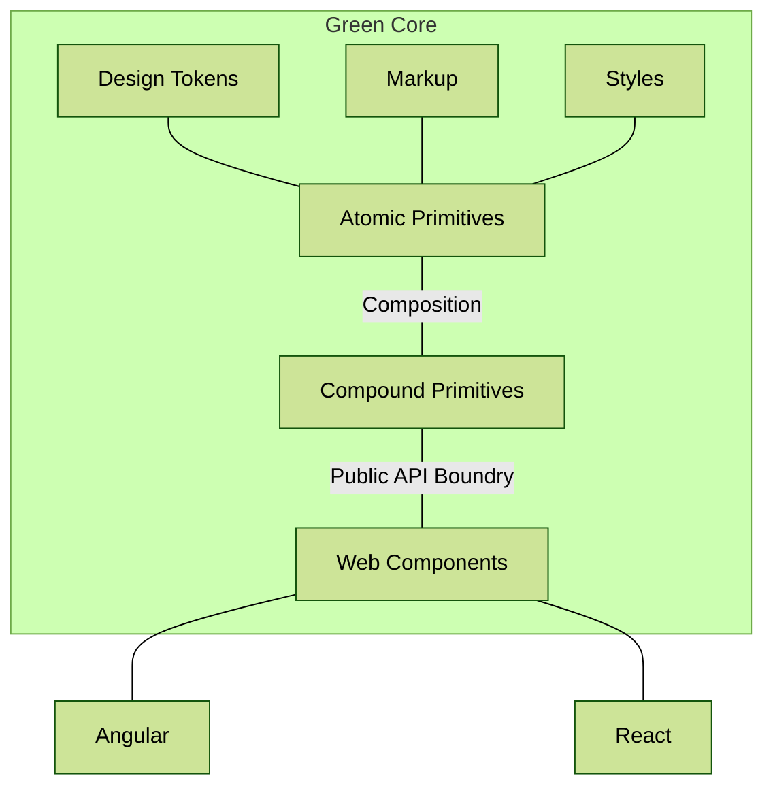

#  core

Green Core is the foundation of the Green Design System, and consists of a set of Web Components that underpins the React and Angular components that are typically used when building applications.

The Web Components are themselves typically composed of a hierarchy of smaller Web Componentes, called primitives, that defines the various atomic pieces that make up a component.

The Green Architecture roughly looks something like this:

Of course, design tokens, markup and styles can be used on all levels of composition, but are only drawn at the top here in order to simplify the diagram.

Public API Boundry before Web Components means that anything that is lower level than a complete component is considered internal to the framework and ahould not be used by consumers. We can only keep the strict guarantees of semantic versioning for the public api. Anything that is considered internal could change in breaking ways on any release.
